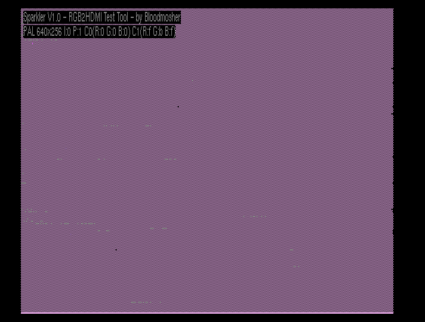

# Amiga Sparkler
Amiga RGB2HDMI test tool used to verify boards do not have sparkling artifacts.

## Instructions
- Just grab a binary from the bin folder and transfer to your Amiga and run it
- The default settings tend to show sparkles on boards that have issues (alternating pixels with a particular color combination on a hires non-interlaced screen).
- Refer to the on-screen help for instructions on how to vary the test pattern (press the HELP key to toggle).

## Video Slot V1.1 Boards
- These boards work well with no known sparkles in my testing. 
- After trying numerous variations on path length, eliminating through-holes, copper fills, regulator placement, etc. the predominant issue seems to be placement of U1 relative to the other chips. 
- If you can find a test pattern either from this tool or from some other source that exhibits issues, I would love to hear about it!
- Learn more about the V1.1 boards here: https://github.com/Bloodmosher/Amiga-VideoSlot-RGBtoHDMI

## Video Slot V1.01 Boards
- These boards work pretty well with overclocking and the extra capacitor, but do exhibit problems on the test pattern:

## Denise Adapter V2 Boards
- These boards work pretty well in most circumstances but do do exhibit problems on the test pattern. 
- It would be interesting to see if the positioning of U1 could be changed (perhaps swap with the regulator?) to see if a similar outcome found on the Video Slot boards could be achieved.

## CPLD Based Boards
- I have not yet tried one of these but will post results as soon as I get one built.
